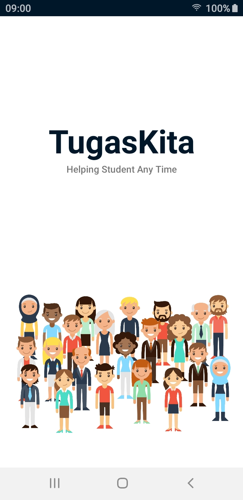
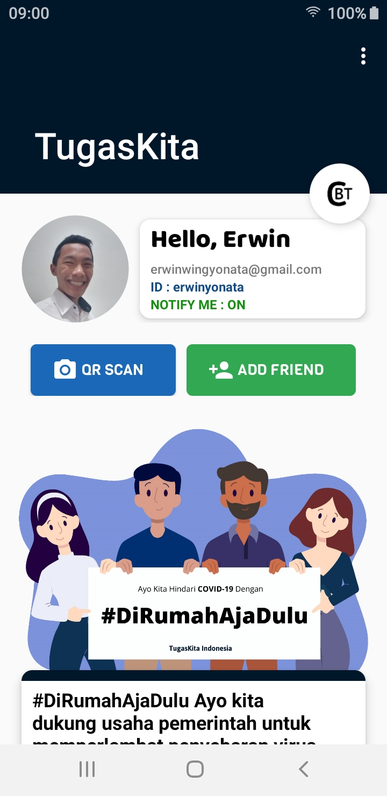
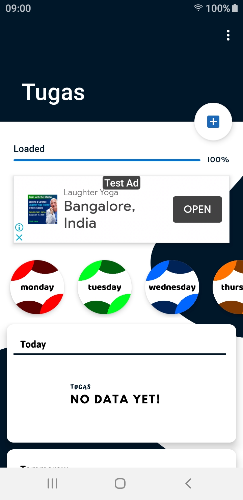
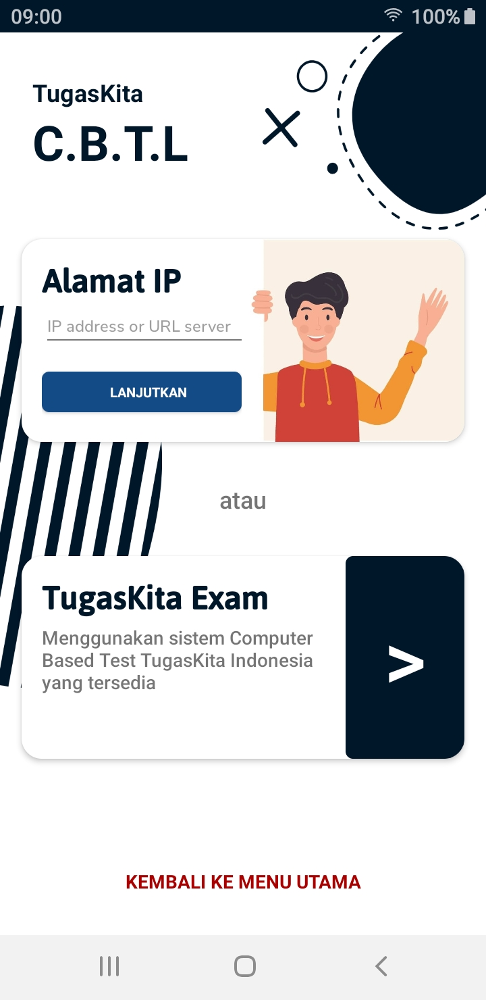

## Welcome

This is my CV website. I write down my performance here and the results of both personal and corporate projects. You are welcome to see it...

### Personal Information

- Name        : Erwin Yonata                    - Skill       : Web Developer, Android Developer, Kubernetes Engine, Machine Learninga and Google Cloud 
- Age         : 17th                            - Personality : ESTP
- Address     : Jl. Kelantan No.23             
- Email       : erwinwingyonata@gmail.com
- Telp        : 088996507760
- Origin      : Indonesia

### Projects

### _TugasKita_

This is an android and web application that I made to help friends in their daily assignments at school. Like the task boards that are written every day to remind friends about the task only through their mobile screens.







```markdown
Syntax highlighted code block

# Header 1
## Header 2
### Header 3

- Bulleted
- List

1. Numbered
2. List

**Bold** and _Italic_ and `Code` text

[Link](url) and 
```
