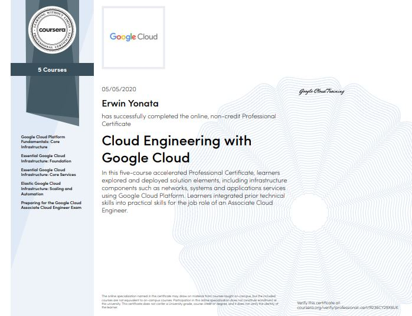
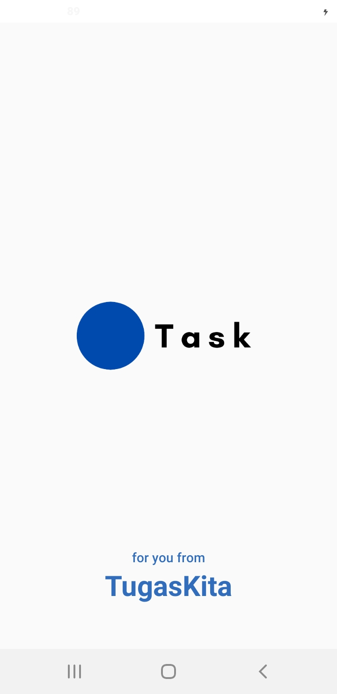
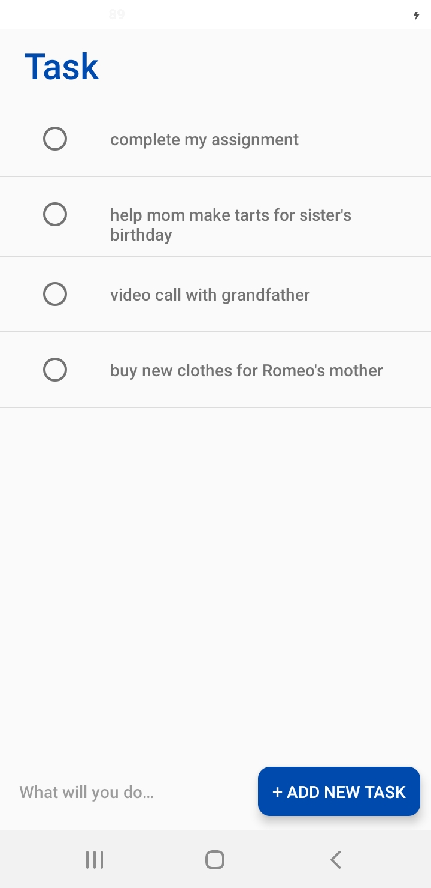
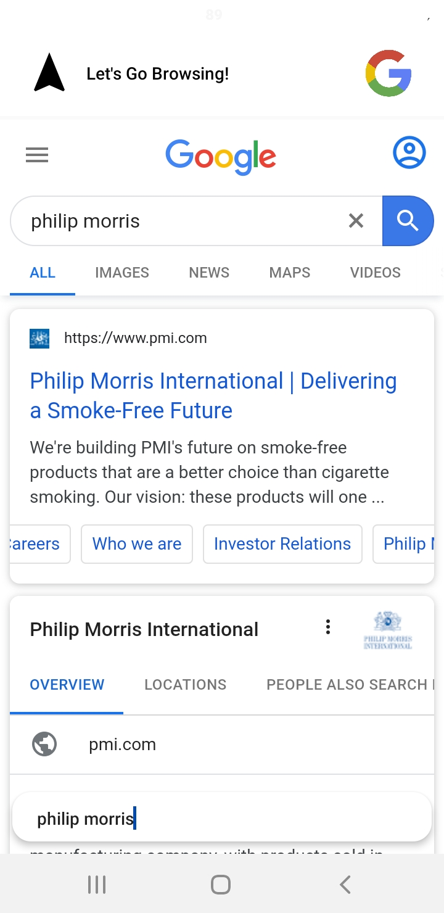
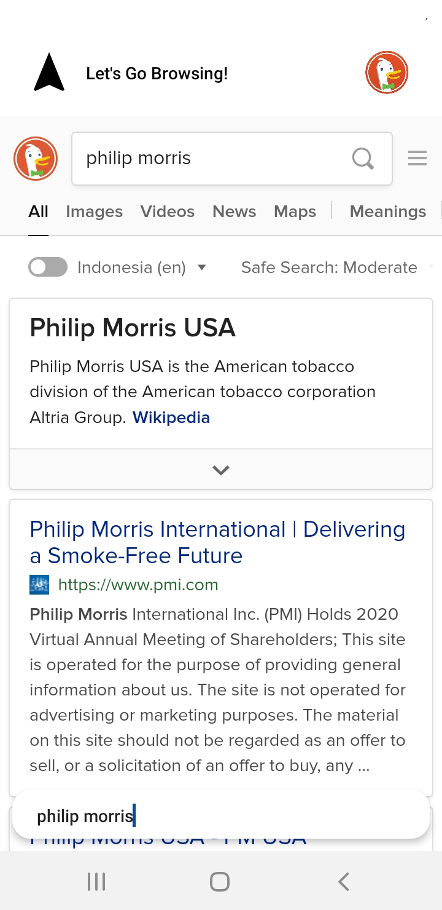
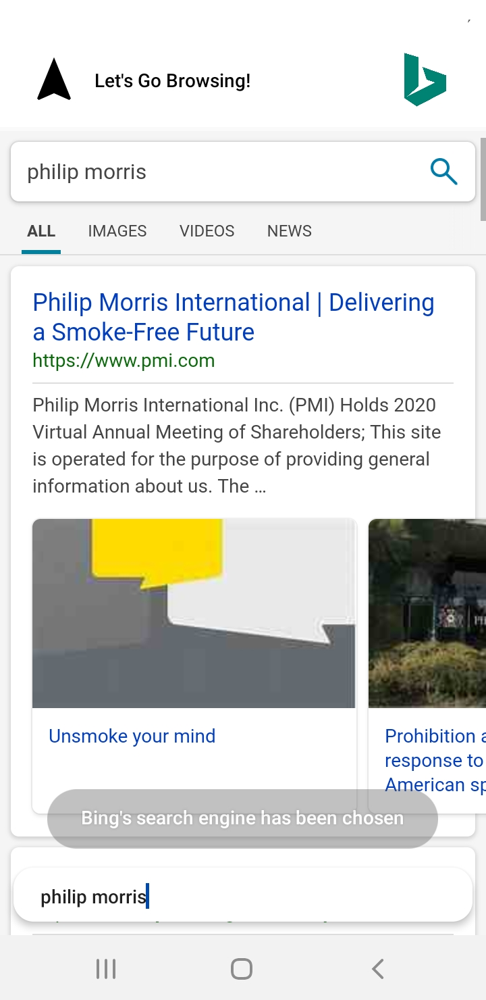
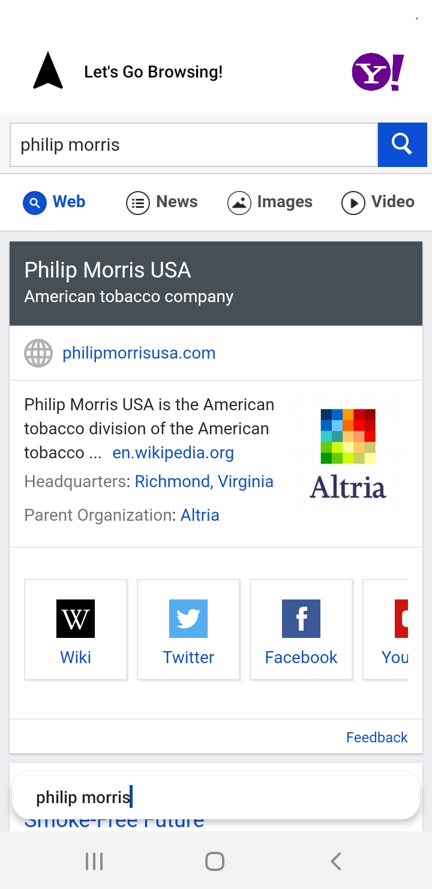

## Welcome

This is my CV website. I write down my performance here and the results of both personal and corporate projects. You are welcome to see it...

### Personal Information

- Name        : Erwin Yonata                    
- Age         : 17th                            
- Address     : Jl. Kelantan No.23             
- Email       : erwinwingyonata@gmail.com
- Telp        : 088996507760
- Origin      : Indonesia
- Skill       : Web Developer, Android Developer, Kubernetes Engine, Machine Learninga and Google Cloud 
- Personality : ESTP

### Certification

### Projects

### _TugasKita_

This is an android and web application that I made to help friends in their daily assignments at school. Like the task boards that are written every day to remind friends about the task only through their mobile screens.

ANDROID

WEB

### _Task_

This application is writing todo list every day. Based on Android written in Kotlin.

ANDROID

### _Ominel_

This is a web browser application. Ominel is a combination of 4 search engines, Google, Bing, Yahoo, and DuckDuckGo.Written in the Kotlin programming language.

ANDROID

Thank for reading.
Bye.

